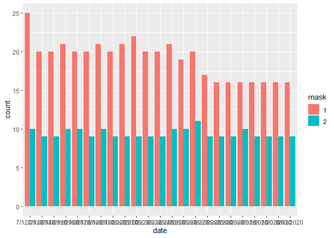

Lab 07 - Conveying the right message through visualisation
================
zheqi
2/20

### Load packages and data

``` r
library(tidyverse) 
```

### Exercise 1

``` r
df <- tribble(
  ~date, ~count, ~mask,
  "7/12/2020", 25, 1,
  "7/12/2020", 10, 2,
  "7/13/2020", 20, 1,
  "7/13/2020", 9, 2,
  "7/14/2020", 20, 1,
  "7/14/2020", 9, 2,
  "7/15/2020", 21, 1,
  "7/15/2020", 10, 2,
  "7/16/2020", 20, 1,
  "7/16/2020", 10, 2,
  "7/17/2020", 20, 1,
  "7/17/2020", 9, 2,
  "7/18/2020", 21, 1,
  "7/18/2020", 10, 2,
  "7/19/2020", 20, 1,
  "7/19/2020", 9, 2,
  "7/20/2020", 21, 1,
  "7/20/2020", 9, 2,
  "7/21/2020", 22, 1,
  "7/21/2020", 9, 2,
  "7/22/2020", 20, 1,
  "7/22/2020", 9, 2,
  "7/23/2020", 9, 2,
  "7/23/2020", 20, 1,
  "7/24/2020", 21, 1,
  "7/24/2020", 10, 2,
  "7/25/2020", 19, 1,
  "7/25/2020", 10, 2,
  "7/26/2020", 20, 1,
  "7/26/2020", 11, 2,
  "7/27/2020", 17, 1,
  "7/27/2020", 9, 2,
  "7/28/2020", 16, 1,
  "7/28/2020", 9, 2,
  "7/29/2020", 16, 1,
  "7/29/2020", 9, 2,
  "7/30/2020", 16, 1,
  "7/30/2020", 10, 2,
  "7/31/2020", 16, 1,
  "7/31/2020", 9, 2,
  "8/01/2020", 16, 1,
  "8/01/2020", 9, 2,
  "8/02/2020", 16, 1,
  "8/02/2020", 9, 2,
  "8/03/2020", 16, 1,
  "8/03/2020", 9, 2,
)
df$mask <- as.factor(df$mask)
```

### Exercise 2

``` r
df %>%
  ggplot(aes(fill=mask, y=count, x=date)) + 
  geom_bar(position='dodge', stat='identity')
```

<!-- -->

\#Exercise 3:

``` r
#In my plot, the difference in mask mandate and no mask mandate is clearer. And for counties where mask is mandated, the number of covid cases tend to be significantly higher than no mandate counties throughout the 23 days.
```

\#Exercise 4:

``` r
#from what I plotted, it is clear that there is a significant drop in number of COVID cases the mask mandate counties over 23 days. The no mask mandate counties have no significant changes in their number of COVID cases. But mask mandate counties have significantly higher number of COVID cases, and that might be the reason they mandate the mask wearing.
```
